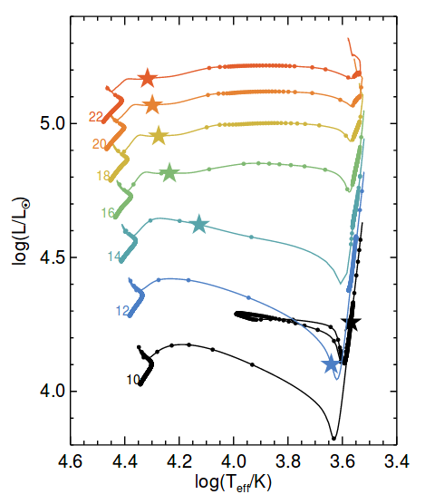
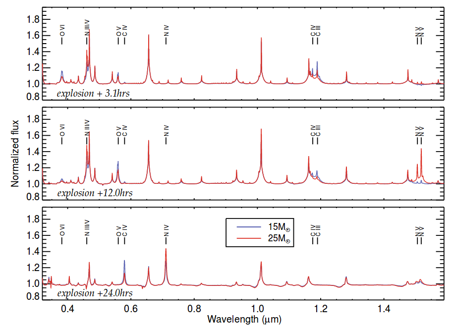

See below a guest post I wrote for [Astrobites](https://astrobites.org/). For the original one [click here](https://astrobites.org/2019/01/28/judging-book-cover-red-supergiant/). 
___
**Title:** [The surface abundances of Red Supergiants at core-collapse](https://arxiv.org/pdf/1811.04087.pdf)

**Authors:** Ben Davies and Luc Dessart

**First Author's Institution:** Astrophysics Research Institute, Liverpool John Moores University

**Status:** accepted for publication in MNRAS

Core-Collapse supernovae (CCSNe) are explosions coming from massive stars (above 8 solar masses) when they reach the end of their life. A [Type II-P Supernova](http://astronomy.swin.edu.au/cosmos/T/Type+II+Supernova) (SN II-P)  is a common type of CCSN which shows a "plateau" in its light curve, driven by a Hydrogen-rich envelope. Observations of the explosion site of some of these objects have shown that the progenitors of these explosions are [Red Supergiant](https://aasnova.org/2018/01/03/astrophysics-of-red-supergiants/) (RSG) stars. From these data several predictions can be made by comparing with stellar evolution models. One test that can be made is to determine the initial mass of the progenitor (the mass at the Main-Sequence), which can be done by comparing the luminosity of the progenitor with model predictions. Another way is to measure the mass of the Hydrogen-rich envelope by modelling the light curve and making some assumptions about the core mass. A different way is to measure [spectral lines](https://astrobites.org/guides/spectroscopy-and-spectral-lines/) of some elements, like Oxygen, at late time (more than 120 days after the explosion, approximately), which correlates with the initial mass as shown by some models.

Unfortunately, these methods do not agree in general, so a proper estimation of the initial mass of the progenitor of a SN II-P can not be made. Having this in mind, the authors of the article proposed a different way of estimating the initial mass by measuring the surface composition (or surface abundance) of the progenitor star at early epochs (less than 1 day approximately). There are two main reasons for this: firstly, at this stage some spectral features are easy to identify, and secondly, the surface abundance is not expected to suffer from explosive mixing at early time, which erases any link to the progenitor mass.

To test this, the authors make use of the [MESA](http://mesa.sourceforge.net/) code to study sets of evolutionary models. The evolution across the [Hertzsprung-Russell](http://astronomy.swin.edu.au/cosmos/H/Hertzsprung-Russell+Diagram) (H-R) diagram is key to understand the different processes and phases a star goes through, so the authors use MESA to evolve stars with different initial masses to study this. As it can be seen in Figure 1, less massive stars cross the H-R diagram more rapidly than more massive star, which means that more massive stars have more time to dredge up material from the inner layers into the surface (mixing the abundances) before the end of the RSG phase. Another factor that has to be taken into account is the mass loss. In general, more massive star loose more mass than the least massive ones, so their outer envelopes are thinner compared to the total size of the star, hence their surface abundances suffer from more mixing.

*Fig. 1: H-R diagram for stars with different initial masses as labelled. The circles mark evenly-spaced time steps. The stars indicate the beginning of the RSG phase. More massive stars take longer to cross the H-R diagram than less massive stars.*

Since the surface abundance can not be directly measured, an indirect way of measurement was developed. The authors demonstrate that the surface abundance can be estimated by measuring the ratio between spectral lines, specifically the Carbon-to-Nitrogen ratio, a few hours after the supernova explosion. They simulate early time supernova spectra coming from stars with three different initial masses. The results of these simulated spectra are shown in Figure 2 for a 15 and 25 solar masses stars, for three epochs: 3.1, 12.0 and 24.0 hours after the explosion. One can clearly see the greater strength of Nitrogen lines in the higher mass model, and the greater strength of Carbon and Oxygen lines in the lower mass model. These same trends have been seen in the observed early-time spectra of SN II-P, however, the lack of data at these early stages is clear.

*Fig. 2: Early-time SN II-P spectra for progenitors of 15 (blue) and 25 (red) solar masses. From top to bottom, spectra of 3.1, 12.0 and 24.0 hours after explosion. It can be seen the difference in the strengths of lines for the two progenitors.*

Like the other methods mentioned above, the surface abundance method suffers from several uncertainties, but no further comparison is given. Finally, the author estimate that within the next decade several early time spectra of SN II-P should be available, which would help decreasing the uncertainties for a better estimation of the initial masses of their progenitors.
