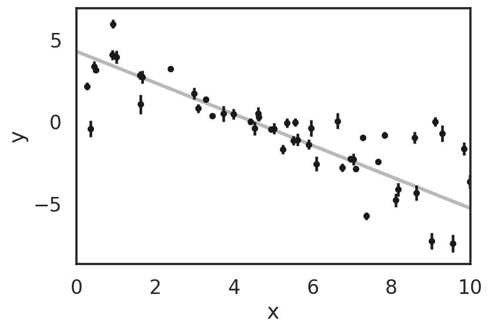
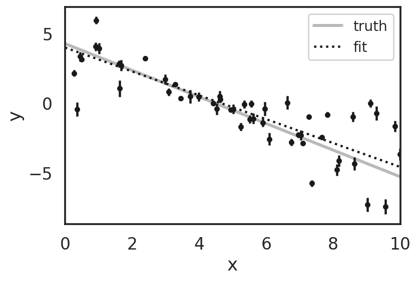
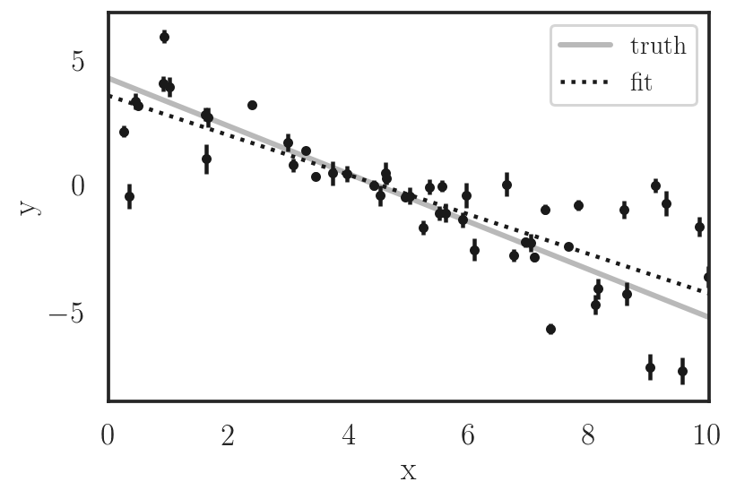

In this notebook I show some basic implementation of different Python packages for data fitting. The idea is to learn the different options there are out there so the reader can then study them in more detail if needed. Note that most of this packages have regular updates, so some of the examples shown below might be borken in the future.

This notebook can be opened in [google colab](https://colab.research.google.com/) or [binder](https://mybinder.org/), but the packages will need to be installed before runnning it. This might take a minute or two.

To open this notebook in google colab, click in the following icon: [](https://colab.research.google.com/github/temuller/personal_website/blob/master/content/post/fitting_data/basic_fitting_routines.ipynb)

To open this notebook on binder, click in the following icon: [](https://mybinder.org/v2/gh/temuller/personal_website/master?filepath=content%2Fpost%2Ffitting_data%2Fbasic_fitting_routines.ipynb)

```python
# This are dependencies for `chainconsumer`, a package to draw contour plots, 
# very similar to `corner`, but I like it better
! sudo apt-get install texlive-latex-recommended 
! sudo apt-get install dvipng texlive-latex-extra texlive-fonts-recommended  
! wget http://mirrors.ctan.org/macros/latex/contrib/type1cm.zip 
! unzip type1cm.zip -d /tmp/type1cm 
! cd /tmp/type1cm/type1cm/ && sudo latex type1cm.ins
! sudo mkdir /usr/share/texmf/tex/latex/type1cm 
! sudo cp /tmp/type1cm/type1cm/type1cm.sty /usr/share/texmf/tex/latex/type1cm 
! sudo texhash 
!apt install cm-super
```


```python
!pip install numpy
!pip install matplotlib
!pip install seaborn
!pip install pandas
!pip install scipy
!pip install lmfit
!pip install emcee
!pip install pystan
!pip install iminuit
!pip install tensorflow
!pip install keras
!pip install multiprocessing
!pip install chainconsumer
```


```python
import matplotlib.pyplot as plt
import seaborn as sns
import numpy as np
import pandas as pd

import scipy
import lmfit
import emcee
#import pymc3  # borken installation?
import pystan
import iminuit
from iminuit.util import describe, make_func_code

from keras.layers import Dense, Activation
from keras.models import Sequential

from multiprocessing import Pool
from chainconsumer import ChainConsumer

sns.set(context='talk', style='white')
%config InlineBackend.figure_format = 'retina'

np.random.seed(32)
```

This example, which represents data taken from a line, was taken from the `emcee` documentation.

To avoid correlation between parameters in this case, one would need to shift the x-axis by the mean value, but I will ommit that in here for simplicity. I will only show how to implement the different packages.


```python
# Choose the "true" parameters.
m_true = -0.9594
b_true = 4.294
f_true = 0.534

# Generate some synthetic data from the model.
N = 50
x = np.sort(10 * np.random.rand(N))
yerr = 0.1 + 0.5 * np.random.rand(N)
y = m_true * x + b_true
y += np.abs(f_true * y) * np.random.randn(N)
y += yerr * np.random.randn(N)

plt.errorbar(x, y, yerr=yerr, fmt=".k", capsize=0)
x0 = np.linspace(0, 10, 500)
plt.plot(x0, m_true * x0 + b_true, "k", alpha=0.3, lw=3)
plt.xlim(0, 10)
plt.xlabel("x")
plt.ylabel("y")
plt.show()
```





## scipy - minimize


```python
def log_likelihood(theta, x, y, yerr):
    m, b = theta
    model = m*x + b
    sigma2 = yerr**2
    return np.sum((y - model)**2 / sigma2)

p0 = np.array([m_true, b_true]) + 0.1 * np.random.randn(2)
results = scipy.optimize.minimize(log_likelihood, p0, args=(x, y, yerr))

m_pred, b_pred = results.x

y_pred = m_pred*x0 + b_pred
y_true = m_true*x0 + b_true

plt.errorbar(x, y, yerr=yerr, fmt=".k", capsize=0)
plt.plot(x0, y_true, "k", alpha=0.3, lw=3, label="truth")
plt.plot(x0, y_pred, ":k", label="fit")
plt.legend(fontsize=14)
plt.xlim(0, 10)
plt.xlabel("x")
plt.ylabel("y")
plt.show()

print(f'm = {m_pred:.4f} (m_true = {m_true})')
print(f'b = {b_pred:.3f} (b_true = {b_true})')
```


    m = -0.8139 (m_true = -0.9594)
    b = 3.792 (b_true = 4.294)


## scipy - curve_fit


```python
def function(x, m, b):
    model = m*x + b
    return model

p0 = np.array([m_true, b_true]) + 0.1 * np.random.randn(2)
pfit, pcov = scipy.optimize.curve_fit(function, x, y, p0=p0, sigma=yerr)

m_pred, b_pred = pfit
m_std, b_std = np.sqrt(pcov[0, 0]), np.sqrt(pcov[1, 1])

y_pred = m_pred*x0 + b_pred
y_true = m_true*x0 + b_true

plt.errorbar(x, y, yerr=yerr, fmt=".k", capsize=0)
plt.plot(x0, y_true, "k", alpha=0.3, lw=3, label="truth")
plt.plot(x0, y_pred, ":k", label="fit")
plt.legend(fontsize=14)
plt.xlim(0, 10)
plt.xlabel("x")
plt.ylabel("y")
plt.show()

print(f'm = {m_pred:.4f} +/- {m_std:.4f} (m_true = {m_true})')
print(f'b = {b_pred:.3f} +/- {b_std:.3f} (b_true = {b_true})')
```


    m = -0.8139 +/- 0.0647 (m_true = -0.9594)
    b = 3.792 +/- 0.344 (b_true = 4.294)


## scipy - leastsq


```python
def residual_function(theta, x, y, yerr):
    m, b = theta
    model = m*x + b
    return (model - y)/yerr

p0 = np.array([m_true, b_true]) + 0.1 * np.random.randn(2)
pfit, pcov, infodict, errmsg, success = scipy.optimize.leastsq(residual_function, p0, 
                                                               args=(x, y, yerr), 
                                                               full_output=1)

m_pred, b_pred = pfit
try:
    m_std, b_std = np.sqrt(pcov[0, 0]), np.sqrt(pcov[1, 1])
except:
    m_std = b_std = np.inf

y_pred = m_pred*x0 + b_pred
y_true = m_true*x0 + b_true

plt.errorbar(x, y, yerr=yerr, fmt=".k", capsize=0)
plt.plot(x0, y_true, "k", alpha=0.3, lw=3, label="truth")
plt.plot(x0, y_pred, ":k", label="fit")
plt.legend(fontsize=14)
plt.xlim(0, 10)
plt.xlabel("x")
plt.ylabel("y")
plt.show()

print(f'm = {m_pred:.4f} +/- {m_std:.4f} (m_true = {m_true})')
print(f'b = {b_pred:.3f} +/- {b_std:.3f} (b_true = {b_true})')
```





    m = -0.8139 +/- 0.0127 (m_true = -0.9594)
    b = 3.792 +/- 0.068 (b_true = 4.294)


## lmfit


```python
def residual_function(params, x, y, yerr):
    m, b = params['m'].value, params['b'].value
    model = m*x + b
    return ((model - y)/yerr)**2

p0 = np.array([m_true, b_true]) + 0.1 * np.random.randn(2)
params = lmfit.Parameters()
params.add('m', value=p0[0])
params.add('b', value=p0[1])
results = lmfit.minimizer.minimize(residual_function, params, args=(x, y, yerr)
                                   , method='lbfgsb')

m_pred, b_pred = results.params['m'].value, results.params['b'].value
m_std, b_std = results.params['m'].stderr, results.params['b'].stderr
if m_std is None and b_std is None:
    m_std = b_std = np.inf

y_pred = m_pred*x0 + b_pred
y_true = m_true*x0 + b_true

plt.errorbar(x, y, yerr=yerr, fmt=".k", capsize=0)
plt.plot(x0, y_true, "k", alpha=0.3, lw=3, label="truth")
plt.plot(x0, y_pred, ":k", label="fit")
plt.legend(fontsize=14)
plt.xlim(0, 10)
plt.xlabel("x")
plt.ylabel("y")
plt.show()

print(f'm = {m_pred:.4f} +/- {m_std:.4f} (m_true = {m_true})')
print(f'b = {b_pred:.3f} +/- {b_std:.3f} (b_true = {b_true})')
```


    m = -0.8605 +/- inf (m_true = -0.9594)
    b = 4.010 +/- inf (b_true = 4.294)


## iminuit


```python
from iminuit import Minuit

def line(m, b, x, y):
    return m*x + b

def residual_function(m, b):
    #b, m = theta
    model = line(m, b, x, y)
    return np.sum(((model - y)/yerr)**2)

minu = Minuit(residual_function)

minu.migrad()  # run optimiser
minu.hesse()   # run covariance estimator
minu.minos()  # run minos estimator

m_pred, b_pred = minu.values.values()
m_std, b_std = minu.errors.values()
m_std_max, b_std_max, m_std_min, b_std_min = minu.merrors.values()

y_pred = m_pred*x0 + b_pred
y_true = m_true*x0 + b_true

plt.errorbar(x, y, yerr=yerr, fmt=".k", capsize=0)
plt.plot(x0, y_true, "k", alpha=0.3, lw=3, label="truth")
plt.plot(x0, y_pred, ":k", label="fit")
plt.legend(fontsize=14)
plt.xlim(0, 10)
plt.xlabel("x")
plt.ylabel("y")
plt.show()

print('Hesse')
print(f'm = {m_pred:.4f} +/- {m_std:.4f} (m_true = {m_true})')
print(f'b = {b_pred:.3f} +/- {b_std:.3f} (b_true = {b_true})')
print('Minos')
print(f'm = {m_pred:.4f} +/- ({m_std_min:.4f}, {m_std_max:.4f}) (m_true = {m_true})')
print(f'b = {b_pred:.3f} +/- ({b_std_min:.3f}, {b_std_max:.3f}) (b_true = {b_true})')

minu.draw_mncontour('m', 'b', nsigma=3)
```

    /home/tomas/anaconda3/envs/pisco/lib/python3.6/site-packages/ipykernel_launcher.py:11: InitialParamWarning: Parameter m does not have initial value. Assume 0.
      # This is added back by InteractiveShellApp.init_path()
    /home/tomas/anaconda3/envs/pisco/lib/python3.6/site-packages/ipykernel_launcher.py:11: InitialParamWarning: Parameter m is floating but does not have initial step size. Assume 1.
      # This is added back by InteractiveShellApp.init_path()
    /home/tomas/anaconda3/envs/pisco/lib/python3.6/site-packages/ipykernel_launcher.py:11: InitialParamWarning: Parameter b does not have initial value. Assume 0.
      # This is added back by InteractiveShellApp.init_path()
    /home/tomas/anaconda3/envs/pisco/lib/python3.6/site-packages/ipykernel_launcher.py:11: InitialParamWarning: Parameter b is floating but does not have initial step size. Assume 1.
      # This is added back by InteractiveShellApp.init_path()
    /home/tomas/anaconda3/envs/pisco/lib/python3.6/site-packages/ipykernel_launcher.py:11: InitialParamWarning: errordef is not given. Default to 1.
      # This is added back by InteractiveShellApp.init_path()


    Hesse
    m = -0.8139 +/- 0.0127 (m_true = -0.9594)
    b = 3.792 +/- 0.068 (b_true = 4.294)
    Minos
    m = -0.8139 +/- (-0.0127, 0.0127) (m_true = -0.9594)
    b = 3.792 +/- (-0.068, 0.068) (b_true = 4.294)


    <matplotlib.contour.ContourSet at 0x7fd0b817a208>


___
___
# MCMC inference

There are a couple of packages for plotting the samples with these methods. One is `corner`, which is well known by most people I would say, and the other one, which I actually prefer and use here, is `chainconsumer`.

___
## emcee


```python
def log_like(theta, x, y, yerr):
    m, b = theta
    model = m*x + b
    sigma2 = yerr ** 2
    return -0.5 * np.sum((y - model)**2/sigma2 + np.log(sigma2))

def log_prior(theta):
    m, b = theta
    if -5.0 < m < 0.5 and 0.0 < b < 10.0:
        return 0.0
    return -np.inf

def log_probability(theta, x, y, yerr):
    lp = log_prior(theta)
    if not np.isfinite(lp):
        return -np.inf
    return lp + log_like(theta, x, y, yerr)

pos = np.array([m_true, b_true]) + 1e-4*np.random.randn(32, 2)
nwalkers, ndim = pos.shape

with Pool() as pool:
    sampler = emcee.EnsembleSampler(nwalkers, ndim, log_probability, 
                                    args=(x, y, yerr), pool=pool)
    sampler.run_mcmc(pos, 4000, progress=True)

samples = sampler.chain[:, 1000:, :].reshape((-1, ndim))
```

    100%|██████████| 4000/4000 [00:13<00:00, 288.01it/s]


```python
cc = ChainConsumer()
cc.add_chain(samples, parameters=['m', 'b'])

# plot chains
fig = cc.plotter.plot_walks(truth={"m": m_true, "b": b_true}, convolve=100)
plt.show()

# plot contours
fig = cc.plotter.plot(figsize=float(ndim), truth={"m": m_true, "b": b_true})
plt.show()
```


```python
m_mcmc = np.percentile(samples[:, 0], [16, 50, 84])
b_mcmc = np.percentile(samples[:, 1], [16, 50, 84])
m_pred, b_pred = m_mcmc[1], b_mcmc[1]
m_std_min, m_std_max = np.diff(m_mcmc)
b_std_min, b_std_max = np.diff(b_mcmc)

y_pred = m_pred*x0 + b_pred
y_true = m_true*x0 + b_true

plt.errorbar(x, y, yerr=yerr, fmt=".k", capsize=0)
plt.plot(x0, y_true, "k", alpha=0.3, lw=3, label="truth")
plt.plot(x0, y_pred, ":k", label="fit")
plt.legend(fontsize=14)
plt.xlim(0, 10)
plt.xlabel("x")
plt.ylabel("y")
plt.show()

print(f'm = {m_pred:.4f} +/- ({m_std_min:.4f}, {m_std_max:.4f}) (m_true = {m_true})')
print(f'b = {b_pred:.4f} +/- ({b_std_min:.4f}, {b_std_max:.4f}) (b_true = {b_true})')
```





    m = -0.8131 +/- (0.0127, 0.0124) (m_true = -0.9594)
    b = 3.7896 +/- (0.0679, 0.0674) (b_true = 4.294)


## pystan


```python
model = """
        data {
            int<lower=0> N;
            vector[N] x;
            vector[N] y;
        }
        parameters {
            real m;
            real b;
            real<lower=0> sigma;
        }
        model {
            y ~ normal(b + m*x, sigma);
        }
        """

data = {'N': len(x), 'x': x, 'y': y}

# Compile the model
sm = pystan.StanModel(model_code=model)

# Train the model and generate samples
fit = sm.sampling(data=data, iter=1000, chains=4, warmup=500, thin=1, seed=101)
```

    INFO:pystan:COMPILING THE C++ CODE FOR MODEL anon_model_1defb22038d84b88c73c6495096e3e42 NOW.


```python
summary_dict = fit.summary()
df = pd.DataFrame(summary_dict['summary'], 
                  columns=summary_dict['summary_colnames'], 
                  index=summary_dict['summary_rownames'])

m_pred, b_pred = df['mean']['m'], df['mean']['b']
m_std, b_std = df['sd']['m'], df['sd']['b']

# Extracting traces
m_trace = fit['m']
b_trace = fit['b']
sigma = fit['sigma']
lp = fit['lp__']

y_pred = m_pred*x0 + b_pred
y_true = m_true*x0 + b_true

plt.errorbar(x, y, yerr=yerr, fmt=".k", capsize=0)
plt.plot(x0, y_true, "k", alpha=0.3, lw=3, label="truth")
plt.plot(x0, y_pred, ":k", label="fit")
plt.legend(fontsize=14)
plt.xlim(0, 10)
plt.xlabel("x")
plt.ylabel("y")
plt.show()

print(f'm = {m_pred:.4f} +/- {m_std:.4f} (m_true = {m_true})')
print(f'b = {b_pred:.3f} +/- {b_std:.3f} (b_true = {b_true})')
```


    m = -0.7944 +/- 0.0828 (m_true = -0.9594)
    b = 3.595 +/- 0.492 (b_true = 4.294)


```python
cc = ChainConsumer()
cc.add_chain(np.array([m_trace, b_trace]).T, parameters=['m', 'b'])

# plot chains
fig = cc.plotter.plot_walks(truth={"m": m_true, "b": b_true}, convolve=100)
plt.show()

# plot contours
fig = cc.plotter.plot(figsize=float(ndim), truth={"m": m_true, "b": b_true})
plt.show()
```


## pymc3


```python
basic_model = pymc3.Model()

with basic_model:
    
    p0 = np.array([m_true, b_true]) + 0.1 * np.random.randn(2)
    # Priors for unknown model parameters
    m = pymc3.Normal('m', mu=p0[0], sigma=2)
    b = pymc3.Normal('b', mu=p0[1], sigma=5)
    sigma = pymc3.HalfNormal('sigma', sigma=1)

    # Expected value of outcome
    model =m*x + b

    # Likelihood (sampling distribution) of observations
    Y_obs = pymc3.Normal('Y_obs', mu=model, sigma=sigma, observed=y)
    
map_estimate = pymc3.find_MAP(model=basic_model)

with basic_model:
   # instantiate sampler
    step = pymc3.Slice()

    # draw 5000 posterior samples
    trace = pymc3.sample(5000, step=step)

pymc3.traceplot(trace);
pymc3.summary(trace).round(2)
```

## Other packages

There are other packages for performing MCMC inference like: `Pyro/NumPyro`, `mici`, `TensorFlow Probability` and `Sampyl` (I might be missing a couple though). Feel free to check those as well.

___
___
# Artificial Neural Networks (ANN) regression

The ANN will fit the data without a given model. A proper fit would require training sets, testing sets and cross validation, but here only the most basic implementation is shown. There is much more you can do with ANN.


```python
# NN model
model = Sequential()
model.add(Dense(32, activation = 'relu'))
model.add(Dense(units = 32, activation = 'relu'))
model.add(Dense(units = 32, activation = 'relu'))
model.add(Dense(units = 1))

# Compiling the ANN
model.compile(optimizer = 'adam', loss = 'mean_squared_error')

model.fit(x[:, None], y, batch_size = 10, epochs = 100, verbose=0)

y_pred = model.predict(x[:, None])
y_true = m_true*x0 + b_true

plt.errorbar(x, y, yerr=yerr, fmt=".k", capsize=0)
plt.plot(x0, y_true, "k", alpha=0.3, lw=3, label="truth")
#plt.plot(x0, y_pred, ":k", label="fit")
plt.plot(x[:, None], y_pred, ":k", label="fit")
plt.legend(fontsize=14)
plt.xlim(0, 10)
plt.xlabel("x")
plt.ylabel("y")
plt.show()
```


```python

```
